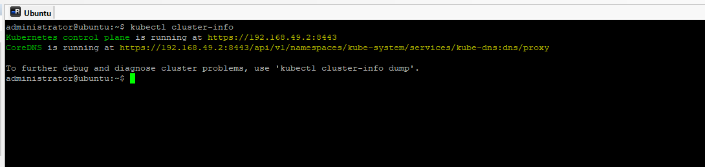
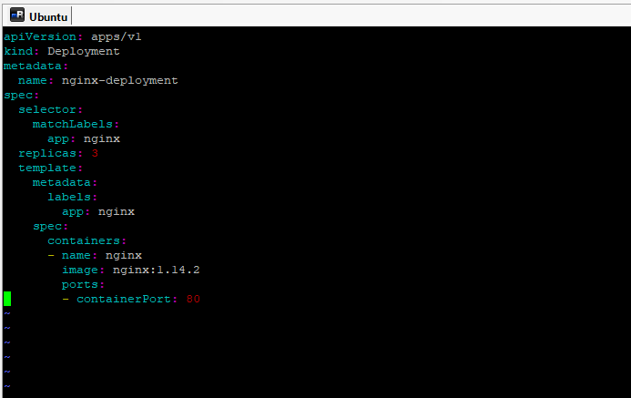
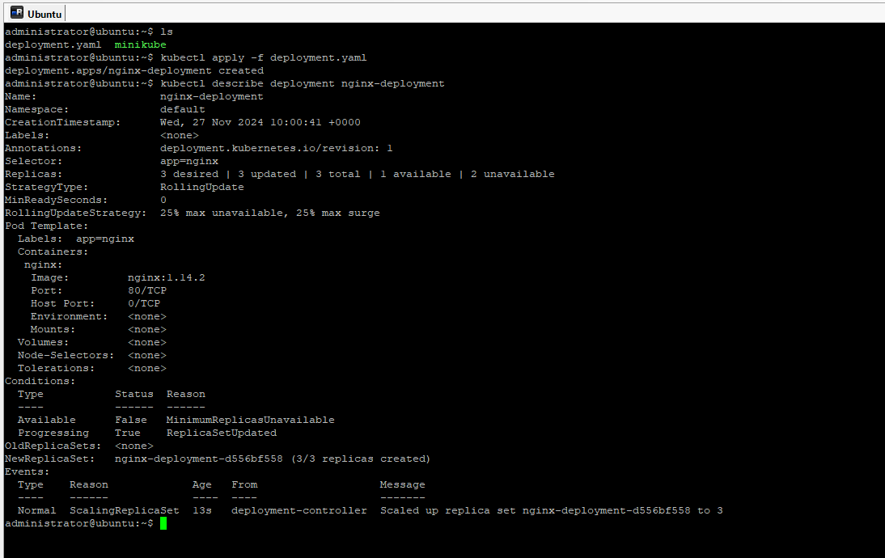
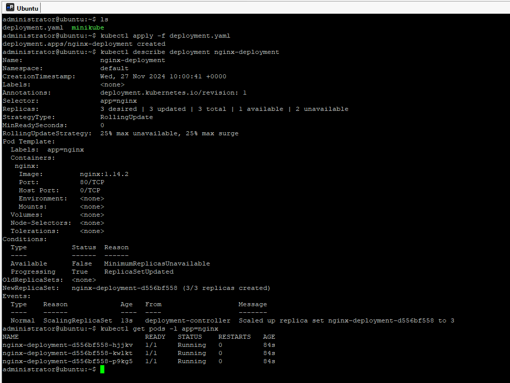
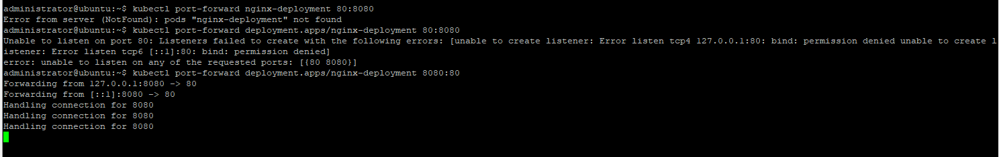
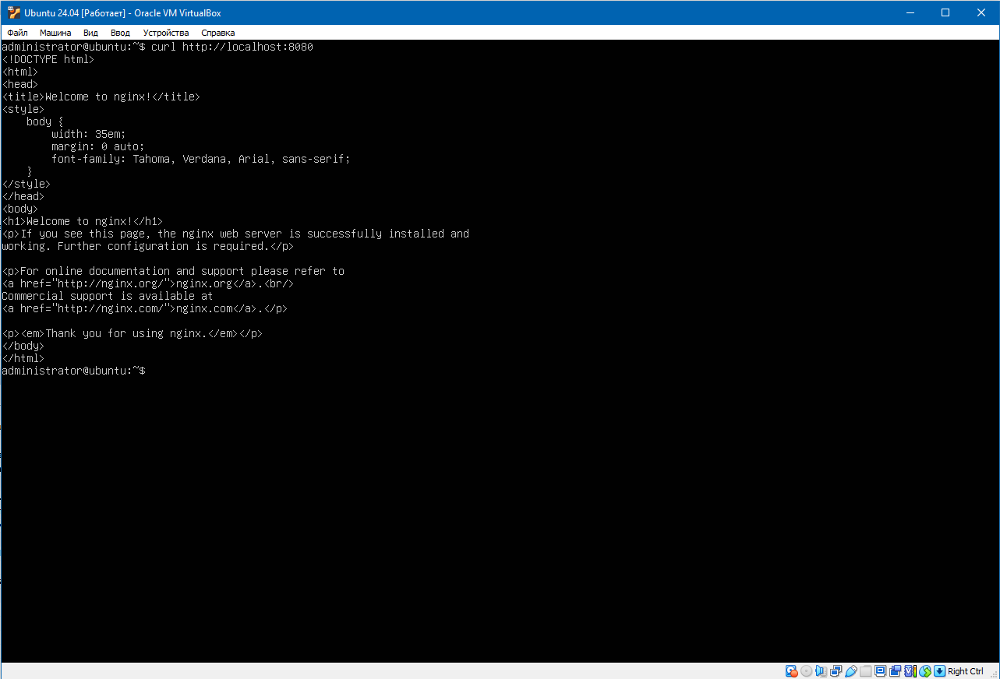

# DevSecOps_Homework_5
 
1. Kubernetes установлен. Информация о кластере отображена в консоли.

2. Подготовлен yaml файл для развёртывания nginx в 3-х репликах. По-умолчанию контейнер слушает 80 порт.

3. Поднимаем поды используя подготовленный yaml-файл.

4. Получаем информацию о состоянии подов / контейнеров.

5. Настраимваем форвардинг портов, чтобы иметь возможность обращаться к приложению, размещённому в контейнере.

6. При помощи утилиты curl проверяем доступность приложения.

